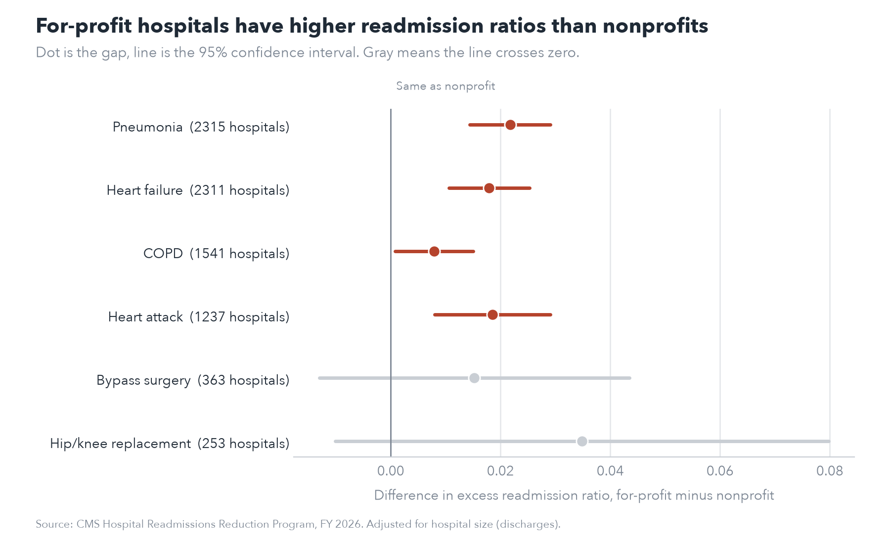

# Hospital readmissions by ownership type

CMS cuts Medicare payments to hospitals that readmit more patients than expected, through the Hospital Readmissions Reduction Program.
Primary Question: I wanted to see if for-profit hospitals do worse on this than nonprofits, and whether that has to do with ownership or just because for-profit hospitals tend to be smaller.

## The number this is based on

Each hospital gets an excess readmission ratio for each condition. It's the hospital's predicted readmission rate divided by what an average hospital would get with the same patients. Above 1.0 means more readmissions than expected, below 1.0 means fewer. It averages out to 1.0, so most hospitals are between about 0.96 and 1.04, and a difference of 0.02 is actually a decent sized gap.

## What I found

For heart failure, 57% of for-profit hospitals were above 1.0, compared to 45% of nonprofits.

| Ownership | Hospitals | Mean ratio | % above 1.0 | Median heart failure discharges |
|---|---:|---:|---:|---:|
| For-profit | 489 | 1.014 | 57% | 191 |
| Government | 354 | 1.009 | 56% | 215 |
| Nonprofit | 1,773 | 0.996 | 45% | 317 |

The last column is the problem. For-profit hospitals are a lot smaller, and smaller hospitals have higher ratios in general. So I ran a regression with ownership and hospital size together. The for-profit gap went from 0.021 to 0.018, so size explains some of it (about 15%) but most of the gap is still there. Splitting hospitals into four size groups shows the same thing, for-profits are higher than nonprofits in every group.

Then, I ran the same size-adjusted regression for all six conditions CMS tracks. For-profits were higher in all six. The gap was statistically significant for heart failure, pneumonia, heart attack and COPD. For bypass surgery and hip/knee replacement it pointed the same way but there weren't enough hospitals (363 and 253) to be sure.



I expected government hospitals to look like for-profits since they were also worse on heart failure. They didn't. For the other five conditions they were basically the same as nonprofits, so the heart failure result for government hospitals might be specific to that condition or just noise.

Ownership and size together only explain about 3% of the variation between hospitals (R-squared of 0.027). So the for-profit gap is real and shows up across conditions, but most of what makes one hospital's readmissions higher than another's is something this data doesn't capture.

## Data

From [CMS Provider Data](https://data.cms.gov/provider-data/topics/hospitals):

- FY 2026 Hospital Readmissions Reduction Program. One row per hospital per condition, 3,055 hospitals.
- Hospital General Information, for ownership type.

## How I did it

I grouped CMS's 12 ownership categories into three: for-profit (proprietary and physician owned), nonprofit (private, church and other nonprofits) and government (local, state, federal, hospital district, VA, military and tribal). Some of the original categories only have a few dozen hospitals, which is too small to compare on their own.

For size I used each hospital's number of discharges for that condition. CMS doesn't report discharges for some hospitals (305 for heart failure), so those were left out of the size-adjusted part. I used the log of discharges in the regression since hospital sizes range from 31 to over 3,000 and going from 50 to 100 patients matters a lot more than going from 3,000 to 3,050.

## Things to keep in mind

This shows for-profit hospitals have higher ratios, not why. Things like the health of the local population, how easy it is for patients to get follow-up care, and staffing aren't in this data and could explain some of the gap.

The ratio is already risk adjusted by CMS, but is not perfect.

The six conditions don't all use the same hospitals, since CMS doesn't report a ratio when a hospital has too few cases. Bypass surgery is missing for most hospitals.

This is one year of data.

## Running it

```bash
python3 -m venv venv
source venv/bin/activate
pip install -r requirements.txt
```

Download the two files above into `data/raw/`, make a `data/clean/` folder, and run the scripts in order:

```bash
python scripts/01_explore.py
python scripts/02_ownership.py
python scripts/03_size_check.py
python scripts/04_all_conditions.py
python scripts/05_chart.py
```

Built with Python, pandas, statsmodels and matplotlib.
